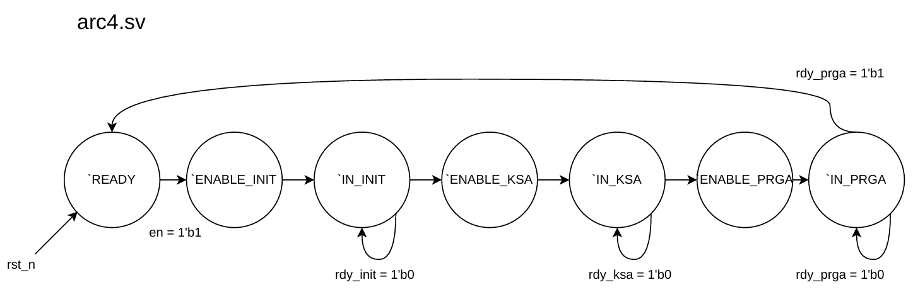
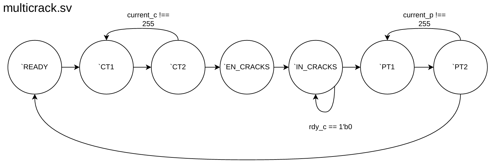
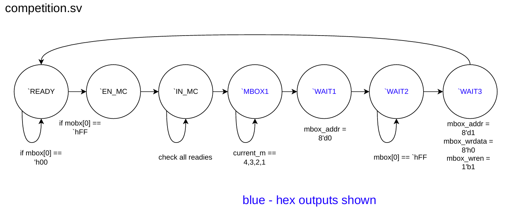
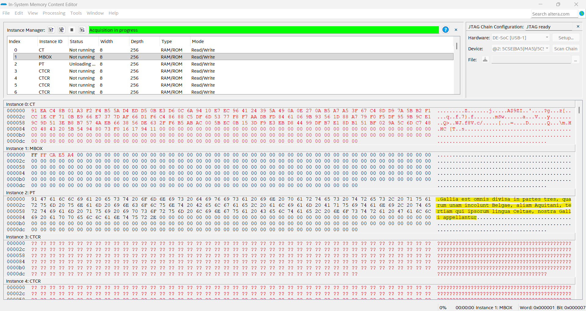
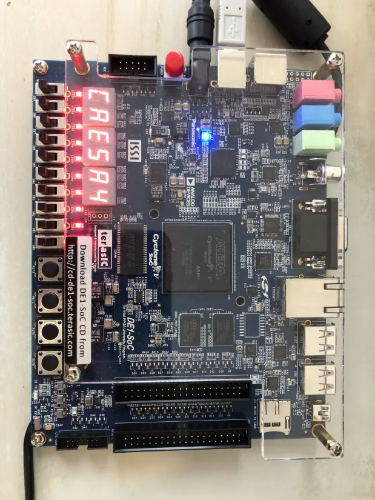
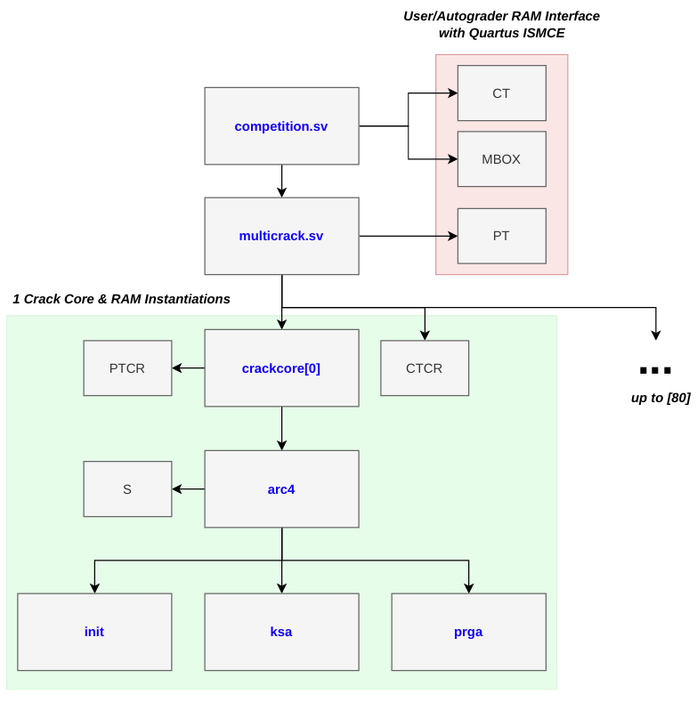

# Multi-Core ARC4 Decryption System 

## Briefing
This is a public display repository for the DE1-SoC FPGA-based ARC4 decryption system designed by David Tang and Hemat Wander for the 2025W2 CPEN 311 section. The multi-core functionality was implemented by David Tang as part of the course's bonus competition at the end of the term. All modules were written in SystemVerilog with the exception of the instantiated RAM IP modules from Quartus.

## ARC4 Background

[ARC4](https://en.wikipedia.org/wiki/RC4) is a symmetric stream cipher historically used as part of some encryption protocols for wireless data. ARC4 generates a pseudo-random byte stream using a given key that is then XOR'd with the plaintext to provide a ciphertext message. The XOR operation is symmetrical, so both the encryption and decryption processes are the same. This decryption system implements a "brute-force attack" where it sifts through all the keys within the given key space until a successful decryption is completed.

## Implementation

The ARC4 Decyption System was designed sequentially following the pseudo-algorithm on the Wikipedia page (which has been converted to C here). There are three main modules: init.sv, ksa.sv, and prga.sv involved with implementing the ARC4 algorithm, which are then driven sequentially by arc4.sv to decrypt a certain message given a known key. crack.sv implements an additional FSM to cycle through keys, repeatedly running arc4.sv and checking the plaintext result until a fully human read-able string in ASCII is detected. multicrack.sv is involved with the instantiations of multiple crack cores. competition.sv is the top-level module for the decryption system.

Each module follows a ready-enable microprotocol, where a 'ready' signal is used for each module to denote when it is ready to be enabled. Each module and a diagram for its FSM is explained below:

### init.sv
The first step of decrypting ARC4 involves initializing the secret internal state 's' into the identity permutation. In our hardware implementation this is done by working with a generated 8-bit, 256 word RAM IP from Quartus (s_mem.v).
```
for(i = 0; i < 256; i++) {
  s[i] = i;
}
```
<p align="center">
  
</p>

### ksa.sv
The second step is to implement a key-scheduling algorithm that mixes in key bytes into the s array in order to prevent statistical correlations in generated ciphertexts. In our hardware implementation, the FSM for KSA requires at most 4 states (excluding `READY) as the swapping mechanism between s[i] and s[j] requires 2 reads and 2 writes, or in other words 4 clock cycles/state transitions.
```
i = 0;
j = 0;
holder = 0;
for(i = 0; i < 256; i++) {
  j = j( j + s[i] + key[i % 3]) % 256;
  holder = s[i];
  s[i] = s[j];
  s[j] = holder;
}
```
<p align="center">
  
</p>

### prga.sv
The third and final step is to implement the pseudo-random generation algorithm. Note the presence of both 'ct' and 'pt' arrays. These are also represented in hardware by additional RAM IPs (ctcore_mem.v, ptcore_mem.v) instantiated from Quartus and used to carry the ciphertext message and the plaintext messages respectively. Note that the ciphertext is a pascal string where the first byte denotes the length of the message. 
```
i = 0;
j = 0;
k = 1;
holder = 0;

message_length = ct[0];
pt[0] = message_length;

for(k = 1; k <= message_length; k++) {
  i = (i + 1) % 256;
  j = (j+s[i]) % 256;
  holder = s[i];
  s[i] = s[j];
  s[j] = holder;
  pt[k] = s[(s[i] + s[j]) % 256] ^ ct[k];
}
```
<p align="center">
  
</p>

### arc4.sv
arc4.sv is a module that enables init, ksa, and prga in a sequential order to decrypt a ciphertext given that it is supplied the correct key for that given ciphertext. In other words, every time it is enabled it operates the decyption process once.

<p align="center">
  
</p>

### crack.sv
crack.sv is a module that does four things: Enable arc4, check the plaintext output for ASCII readability, increment the key if the plaintext output is not human-readable, and loop. A readable human ASCII output contains a string of bytes with hexadecimal characters between 'h20 and 'h7E inclusive. In the event that the entire plaintext string meets the aforementioned condition, a key valid flag is set high and the state returns to READY exiting the loop. In the event that the key incrementer reaches its maximum value without a readable ASCII text detected, the state also returns to READY but without setting the key valid flag high. Due to this cumulative functionality per module, each instantiated crack is **referred to as a core** for this project. 

<p align="center">
  
</p>

### multicrack.sv
multicrack.sv is a module that instantiates multiple crack modules using generate blocks to achieve a faster decrpytion rate for the competition. Since each crack core reads from its own ciphertext RAM module (ctcore_mem.v), multicrack writes the user input top module ciphertext (ct_mem.v) into each ctcore memory block. Likewise each crack core also has its own plaintext RAM module and so multicrack also writes the correct plaintext message from one of the cores that has set its key valid flag high into the top module plaintext (pt_mem.v). 

<p align="center">
  
</p>

### competition.sv
competition.sv is the top module for the decryption system. It enables the multicrack module and is compliant with the 'MBOX' communication protocol listed below. It also contains combinational logic that displays the correct key in big-endian on the DE1-SoC board's HEX outputs and sets the row of LEDs to represent the bit value of the key valid flag. 
```
1. User loads ciphertext in RAM with instance ID 'CT' (for this project, ct_mem.v)
2. User MBOX[0] to 'hFF to prompt competition.sv to enable multicrack. (for this project, mbox_mem.v)
3. User waits until competition.sv sets MBOX[1] to 'hFF to signal completion of cracking. User is able to read the key in big-endian from MBOX[2:4] 
4. User sets MBOX[0] to 'h00 to signal to competition that a new ciphertext may be provided for another round of cracking and waits one second. In this duration, competition.sv sets MBOX[1] to 'h00 to cease completion
5. User is capable of repeating steps 1-4 indefinitely
```
<p align="center">
  
</p>

**Here are some images of decryption on the DE1-SoC:**

<p align="center">
  
</p>
<p align="center">
  
</p>

## Decryption Results 

6 test messages were run to roughly measure the key-sifting speed of this implementation. All time recordings were done manually. The average key-sifting speed stands at `~1.87 million keys per second`

| File     | Crack Time (s) | Key    | Message |
|----------|----------------|--------|---------|
| msg1.mif | 6.13           | BE001F | Hwaet. We Gardena in geardagum, theodcyninga, thrym gefrunon, hu tha aethelingas ellen fremedon |
| msg2.mif | 5.40           | 9ABBE4 | Twas brillig, and the slithy toves did gyre and gimble in the wabe: all mimsy were the borogoves, and the mome raths outgrabe |
| msg3.mif | 7.42           | CAE5A4 | Gallia est omnis divisa in partes tres, quarum unam incolunt Belgae, aliam Aquitani, tertiam qui ipsorum lingua Celtae, nostra Galli appellantur |
| msg4.mif | 6.38           | C1CA60 | The fog comes on little cat feet. It sits looking over harbor and city on silent haunches and then moves on. |
| msg5.mif | 8.13           | DABA4D | Let me not to the marriage of true minds admit impediments. Love is not love which alters when it alteration finds, or bends with the remover to remove. |
| msg6.mif | 2.48           | 424242 | Far out in the uncharted backwaters of the unfashionable end of the Western Spiral arm of the Galaxy lies a small unregarded yellow sun |

In addition, here are some comparison benchmarks between the pre-bonus implementation with two cores by group B1 (DT + HW) and the multi-core implementation by DT:

| Message        | Key     | Doublecrack Time | Multicrack Time | Speedup     | Core Scaling |
|----------------|---------|------------------|-----------------|-------------|--------------|
| B1 Demo        | 363636  | 1m 2.79s         | 1.75s           | 35.88×      | 40.5× cores  |
| extra3.mif     | DAB0A7  | 6m 23.88s        | 9.78s           | 39.33×      | 40.5× cores  |

## Design Summary
The final implementation instantiated 81 crack cores and utilized 29,523/32070 or 92% of all ALMs on the Cyclone V FPGA. The system also runs on the default 50 MHz clock frequency of the DE1-SoC board. Attached below is a block diagram depicting all module instantiations, with the RAM IP instantiations denoted by their instance IDs in grey text:

<p align="center">
  
</p>

## Concluding Remarks

If I have time to return to this project, I may consider increasing the clock frequency by incorporating a PLL IP from Quartus to scale up the default board 50 MHz and accelerate the key-sifting speeds even further. 

For further details, I recommend reading the comments in both the design and testbench SystemVerilog files located in the src and tb folders respectively.

**Thanks for checking out this project!**
