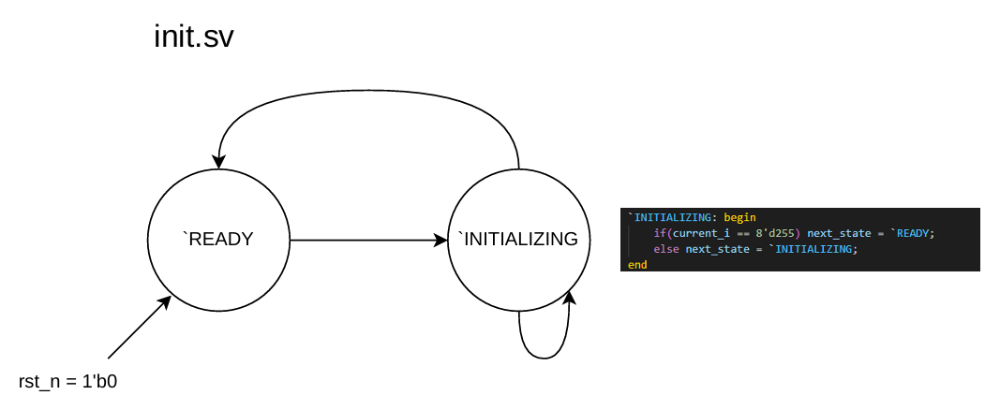

# Multi-Core ARC4-Decryption-System 

## Briefing
This is a public display repository for the DE1-SoC based ARC4 decryption system designed by David Tang and Hemat Wander for the 2025W2 CPEN 311 section. The multi-core functionality was implemented by David Tang as part of the course's bonus competition at the end of the term.

## ARC4 Background

[ARC4](https://en.wikipedia.org/wiki/RC4) is a symmetric stream cipher historically used as part of some encryption protocols for wireless data. ARC4 generates a pseudo-random byte stream using a given key that is then XOR'd with the plaintext to provide a ciphertext message. The XOR operation is symmetrical, so both the encryption and decryption processes are the same. 

## Implementation

The ARC4 Decyption System was designed sequentially following the pseudo-algorithm on the Wikipedia page (which has been converted to C here). There are three main modules: init.sv, ksa.sv, and prga.sv involved with implementing the ARC4 algorithm, which are then driven sequentially by arc4.sv to decrypt a certain message given a known key. crack.sv implements an additional FSM to cycle through keys, repeatedly running arc4.sv and checking the plaintext result until a fully human read-able string in ASCII is detected. doublecrack.sv and multicrack.sv are involved with the instantiations of multiple crack cores. Each module is explained below:

### init.sv
The first step of decrypting ARC4 involves initializing the secret internal state 's' into the identity permutation. In our hardware implementation this is done by working with a generated 256 word RAM IP from Quartus named as 'S_MEM'.
```
for(i = 0; i < 256; i++) {
  s[i] = i;
}
```
<p align="center">
  
</p>

### ksa.sv
The second step is to implement a key-scheduling algorithm that mixes in key bytes into the s rray in order to prevent statistical correlations in generated ciphertexts. 
```
i = 0;
j = 0;
holder = 0;
for(i = 0; i < 256; i++) {
  j = j( j + s[i] + key[i % 3]) % 256;
  holder = s[j];
  s[i] = s[j];
  s[j] = holder;
}
```


### ksa.sv
The purpose of this module is t


